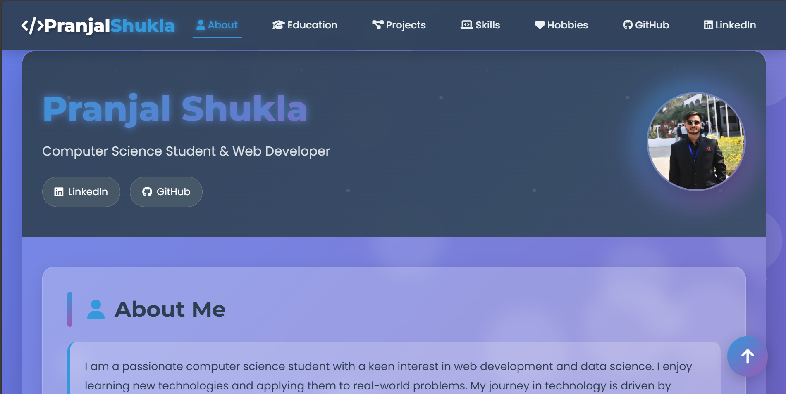

# 🌐 Pranjal Shukla - Interactive Portfolio

This is my personal interactive portfolio website built with **HTML5, CSS3, and JavaScript**.  
It showcases my **skills, projects, education, hobbies, and contact details** in a modern glassmorphism design with animations.

---

## 🚀 Features

- 🌟 Responsive design with animations
- 🧑‍💻 About me, Education, Projects, and Skills sections
- 🎨 Glassmorphism & gradient UI
- 📱 Mobile-friendly navigation
- ⬆️ Floating scroll-to-top button
- 🎭 Interactive hover effects
- 🔗 GitHub & LinkedIn integration

---

## 🛠️ Technologies Used

- **HTML5**
- **CSS3** (Flexbox, Grid, Animations)
- **JavaScript (Vanilla)**
- **FontAwesome** (icons)
- **Google Fonts** (Montserrat & Poppins)

---

## 📷 Preview



---

## 🔧 Installation & Usage

1. Clone the repository:

   ```bash
   git clone https://github.com/Pranjal578/portfolio.git
